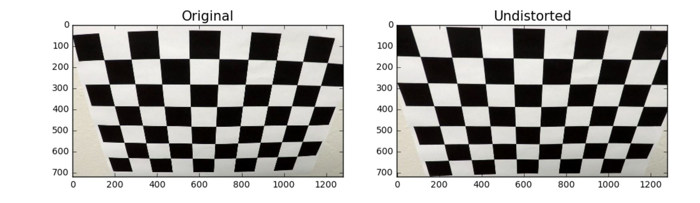
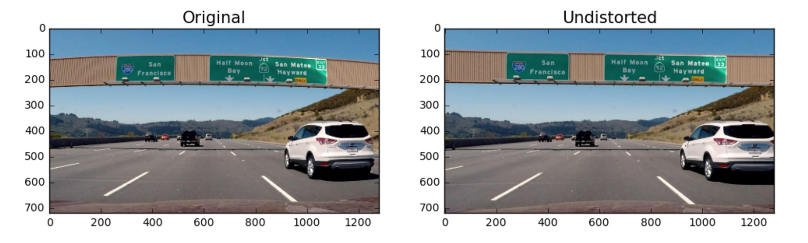
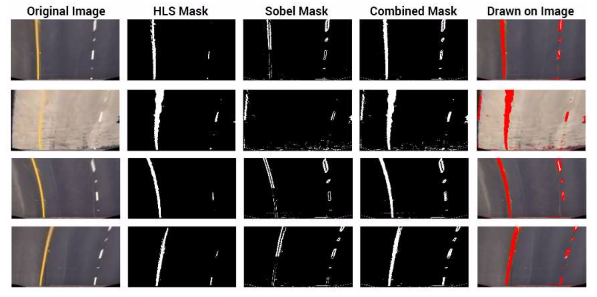
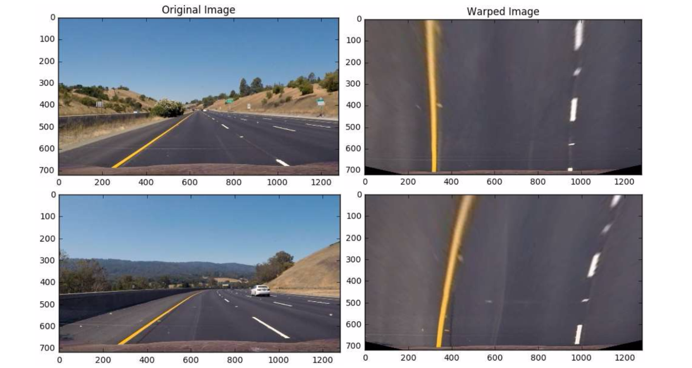
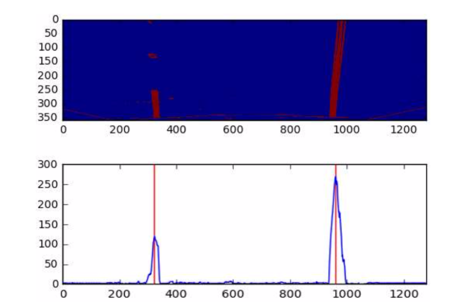
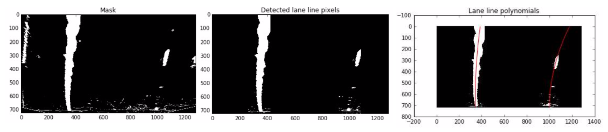

# Advance Lane Finding Documentation
#### By: [Eqbal Eki](http://www.eqbalq.com/)

****

###Steps:
    
1. Camera Calibration
2. Distortion Correction
3. Binary Thresholding
4. Perspective Transform
5. Detect Lane Lines
6. Determine Lane Curvature
7. Impose Lane Boundaries on Original Image
8. Output Visual Display of Lane Boundaries and Numerical Estimation of Lane Curvature and Vehicle Position

###Flow:

Here is the flow that I'm using for lane detection: 

... to be filled later on when the final module built

#### 1. Camera Calibration

In this stage, I read in a series of test images from the camera_cal directory. Each image is a view of a chessboard pattern at various angles.

I use the OpenCV function findChessBoardCorners() to find the x,y coordinates of each corner on a given image. Once I have an array with all these corners, I use the OpenCV calibrateCamera() function to calculate the camera matrix, the vector of distortion coefficients, and the camera vectors of rotation and translation.

To go more in details of how I implemented this. I created `CameraCalibrate` class, this way we keep the code more organized and reusable, I used [SRP](https://en.wikipedia.org/wiki/Single_responsibility_principle) principle so we usually the class has one main thing to do, in this case as the name indicate it calibrate the camera.

Another added value of using Class is that this way I'll only need to compute the matrix and coefficients once and it can then be applied easily at any point. 

It works like this:

```python
# Calibrate the camera and create camera matrix and distortion coefficients
cc = CameraCalibrate(hcount=6, vcount=9)
# Get the images from /camera_cal folder
cc.get_images()
cc.call()
# Run it in new images
cc.undistort(img)
```

When initialized we provide the size of the chessboard (in our case it's 9X6). 

To compute the camera matrix and distortion coefficients, `CameraCalibrate` uses OpenCV's `findChessBoardCorners` function on grayscale version of each input image, ti generate set of image points. 

The class will skip any images that have parts of the chessboard cut-off, printing a warning (some images in the dataset has this issue)


#### 2. Undistort Image

Once we have calibrated the camera as above, we can now apply the camera matrix and distortion coefficients to correct distortion effects on camera input images. This is done using the OpenCV 'undistort()' function.

I use `numpy.mgrid` in order to create a matrix of (x, y, z) object points. Once I have the image points and the matching object points for the entire calibration dataset, I then use `cv2.calibrateCamera` to create the camera matrix and distortion coefficients. These variables are stored inside the class, until `calibraion.undistort(img)` is called, at which point they are passed into `cv.undistort`, returning an undistorted version of the user's input image







#### 3. Binary Thresholding

The Thresholding stage is where we process the undistorted image and attempt to mask out which pixels are part of the lanes and remove those that are not. 

To achieve this, I used combination of different transforms.

First, I used `cv2.cvtColor()` to convert to HLS space, where I created a binary mask, detecting pixels where hue < 100 and saturation > 100 as lane line pixels.

After this, I also created a mask which used a threshold on absolute Sobel magnitude. I decided to go with mask which applied different Sobel thresholds to the top and bottom halves of the image. as the top half of the image had smoother gradients due to the prospective transform. At the end, I selected any pixel > 10 sobel magnitude at the top of the image, and > 35 at the bottom of the image.

I found that the HLS threshold worked better closer to the car, and the Sobel threshold worked better further away. So, a bitwise `OR` of these two thresholds gave me one that I was very happy with.

The binary thresholding code can be found in the `mask_image` method in `helpers.py` file.





#### 4. Perspective Transform

For this section I wrote `PerspectiveTransformer` class, which allow me to wrap/unwrap percpective in single line while only having to compute the transformation matrix once.

I used `cv2.getPrespectiveTranform` to compute the transformation and inverse it. And then applied the images using `cv2.warpPerspective`. The code looks like this:

```python
class PerspectiveTransformer():
    def __init__(self, src, dist):
        self.Mpersp = cv2.getPerspectiveTransform(src, dst)
        self.Minv   = cv2.getPerspectiveTransform(dst, src)

    # Apply perspective transform
    def warp(self, img):
        return cv2.warpPerspective(img, self.Mpersp, (img.shape[1], img.shape[0]))

    # Reverse perspective transform
    def unwarp(self, img):
        return cv2.warpPerspective(img, self.Minv, (img.shape[1], img.shape[0]))
```

For my transformation, I went with with the following `src` and `dst` points:

```python
src = np.array([[585, 460], [203, 720], [1127, 720], [695, 460]]).astype(np.float32)
dst = np.array([[320, 0], [320, 720], [960, 720], [960, 0]]).astype(np.float32)
```





#### 5. Detect Lane Lines

This stage is where we will try to extract the actual lane pixels for both the left and right lanes from the images.

First, in order to know where the lane line begin, I created a histogram of the masked pixels in the bottom half of the image, and selected the biggest peak in both the left and right sides.



The secound step was to use `numpy` to split the image into a specific number of chunks (10 to be exact). In each chuck, we do:

  - Take the mean pixel x-position of the last chuck 
  - Select all masked pixels within 80 pixels of this value
  - Add coordinates of these pixels on an array 

So, I ended up with an array of (x,y) values for both the left and the right lane line. 

I used `numpy.polyfit` to then fit a quadratic curve to each lane line, which can then be plotted on the input frame.

To smooth out the final curve result, I took a weighted mean with the last frame's polynomial coefficients (`w=0.2`).



For more details check out the `helpers.py` file:

```python
# helpers.py

# Find the peaks of the bottom half, for sliding window analysis
def find_initial_peaks(final_mask, bottom_pct=0.5):
    # bottom_pct: How much of the bottom to use for initial tracer placement
    
    shape = final_mask.shape
    
    bottom_sect = final_mask[-int(bottom_pct*shape[0]):, :]
    
    left_peak = bottom_sect[:, :int(0.5*shape[1])].sum(axis=0).argmax()
    right_peak = bottom_sect[:, int(0.5*shape[1]):].sum(axis=0).argmax() + 0.5*shape[1]
    
    # Return x-position of the two peaks
    return left_peak, right_peak

# This applies the sliding window approach to find lane pixels, and then fits a polynomial to the found pixels.
def sliding_window_poly(final_mask, left_peak, right_peak, num_chunks=10, leeway=80):
    # num_chunks: Number of chunks to split sliding window into
    # leeway: Number of pixels on each side horizontally to consider
    
    # Split the image vertically into chunks, for analysis.
    chunks = []
    assert final_mask.shape[0] % num_chunks == 0, 'Number of chunks must be a factor of vertical resolution!'
    px = final_mask.shape[0] / num_chunks # Pixels per chunk
    for i in range(num_chunks):
        chunk = final_mask[i*px:(i+1)*px, :]
        chunks.append(chunk)

    # Reverse the order of the chunks, in order to work from the bottom up
    chunks = chunks[::-1]
    
    # Loop over chunks, finding the lane centre within the leeway.
    lefts = [left_peak]
    rights = [right_peak]
    
    left_px, left_py, right_px, right_py = [], [], [], []
    
    for i, chunk in enumerate(chunks):
        offset = (num_chunks-i-1)*px
        
        last_left = int(lefts[-1])
        last_right = int(rights[-1])
        
        # Only consider pixels within +-leeway of last chunk location
        temp_left_chunk = chunk.copy()
        temp_left_chunk[:, :last_left-leeway] = 0
        temp_left_chunk[:, last_left+leeway:] = 0
        
        temp_right_chunk = chunk.copy()
        temp_right_chunk[:, :last_right-leeway] = 0
        temp_right_chunk[:, last_right+leeway:] = 0
        
        # Save the x, y pixel indexes for calculating the polynomial
        left_px.append(temp_left_chunk.nonzero()[1])
        left_py.append(temp_left_chunk.nonzero()[0] + offset)
        
        right_px.append(temp_right_chunk.nonzero()[1])
        right_py.append(temp_right_chunk.nonzero()[0] + offset)
    
    # Create x and y indice arrays for both lines
    left_px = np.concatenate(left_px)
    left_py = np.concatenate(left_py)
    right_px = np.concatenate(right_px)
    right_py = np.concatenate(right_py)
    
    # Fit the polynomials!
    l_poly = np.polyfit(left_py, left_px, 2)
    r_poly = np.polyfit(right_py, right_px, 2)
    
    return l_poly, r_poly

```


#### Video Output

The final result of my algorithm for this project video can be found here: 

[](http://www.youtube.com/watch?v=xmYNKJdVdz4)


